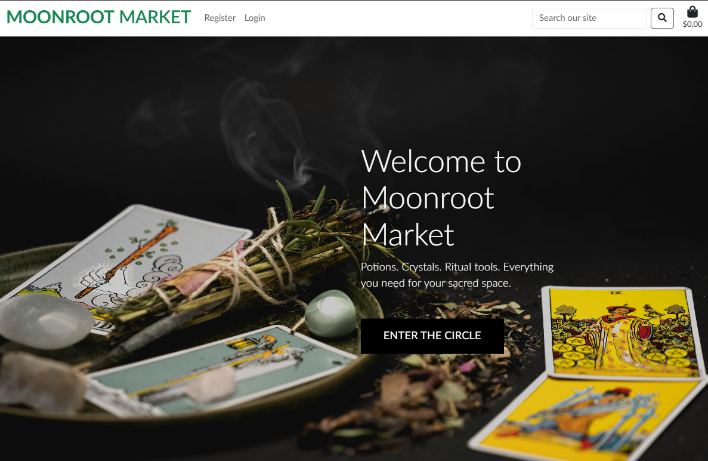

---

<h1 align="center"><strong>MOONROOT MARKET</strong>

---

# Content
* [Moonroot Market](#moonroot-market)
* [Project Overview](#project-overview)
* [Project Milestones](#project-milestones)
* [Goal & UX](#goal--ux)
  * [Website Structure](#website-structure)
  * [Responsiveness](#responsiveness)
* [Keywords](#business-overview)
* [Wireframes](#wireframes)
* [Development Process](#development-process)
* [Future Adding](#future-adding)
* [Agile Methodology](#agile-methodology)
* [Testing](#testing)
* [Features](#features)
  * [Technologies Used](#technologies-used)
  * [Libraries](#libraries)
  * [VsCode migration](#vs-code-migration)
  * [PostgreSQL Setup](#postgresql-setup)
  * [Deployment](#deployment)
* [Acknowledgements](#acknowledgements)

#  Moonroot Market — Keyword Research

##  Business Overview

**Moonroot Market** is a mystical e-commerce store offering:

- Crystals and healing stones  
- Legal functional/magic mushrooms  
- Spellcraft goods and magical potion drinks  

Our focus is on customers seeking spiritual, alternative wellness products and magical supplies.

---

## Keyword Research Process

### Step 1: General Topic Brainstorm

I began by identifying broad themes that potential customers might search for:

- Crystals & Healing Stones  
- Magic Mushrooms & Psychedelic Wellness  
- Spellcraft & Witchy Potions  
- Spiritual Wellness & Rituals  
- Online Metaphysical Shopping  

---

### Step 2: Initial Keyword Brain Dump

| Topic                        | Example Keywords                                                  |
|-----------------------------|-------------------------------------------------------------------|
| Crystals & Healing          | crystals for anxiety, chakra stones, healing stones shop         |
| Magic Mushrooms             | buy shrooms online, psilocybin UK, microdosing mushroom kits     |
| Spell Potions               | herbal magic drinks, love spell potion, energy potion            |
| Spiritual Wellness          | moon ritual kits, aura cleansing, lunar magic supplies           |
| Metaphysical Shopping       | online witch shop, holistic healing store, metaphysical goods UK |

---

### Step 3: Google Search Research

I used Google to validate and refine our keyword list by checking:

- **Autocomplete suggestions**  
- **"People also ask"** questions  
- **Related searches** at the bottom of search results  

This helped identify how real users phrase their searches.

---

### Step 4: Short-Tail & Long-Tail Balance

A mix of general and specific search terms ensures wider reach and targeted traffic.

| Short-Tail Keywords         | Long-Tail Keywords                                               |
|----------------------------|------------------------------------------------------------------|
| crystals                   | buy healing crystals online                                     |
| magic mushrooms            | legal magic mushrooms UK                                        |
| spell potions              | herbal spell potions for beginners                              |
| witch shop                 | online witchcraft shop UK                                       |
| energy cleansing           | crystals to cleanse bad energy                                  |
| psilocybin                 | psilocybin microdosing kit UK                                   |
| moon ritual kit            | moon magic ritual supplies                                      |
| metaphysical store         | metaphysical products online                                    |
| holistic healing           | holistic healing products for spiritual growth                  |

---

### Step 5: Evaluation with SEO Tools

Used tools like:

- [Wordtracker](https://www.wordtracker.com/)  

Metrics we reviewed:

- Search volume  
- SEO competition level  
- Relevance and user intent  

---

## Final Keyword List

**Short-Tail Keywords**

- crystals  
- magic mushrooms  
- spell potions  
- psilocybin  
- witch shop  
- metaphysical store  

**Long-Tail Keywords**

- buy healing crystals online  
- legal magic mushrooms UK  
- herbal spell potions for beginners  
- psilocybin microdosing kit UK  
- moon magic ritual supplies  
- online witchcraft shop UK  
- holistic healing products for spiritual growth  
- crystals to cleanse bad energy  

---

##  Conclusion

This keyword research forms the foundation for Moonroot Market’s:

- Product SEO  
- Blog content strategy  
- Meta descriptions  
- Category landing pages  

